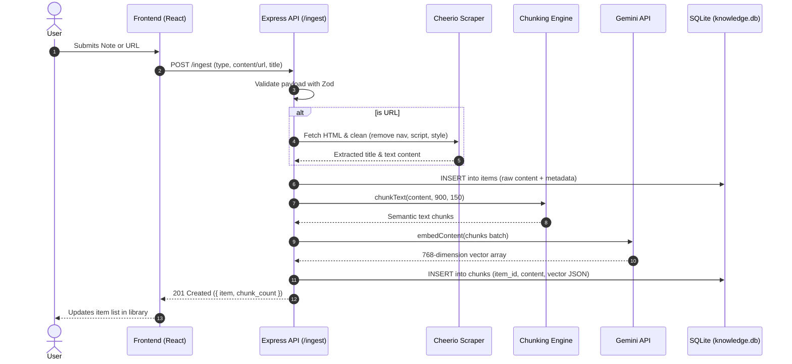
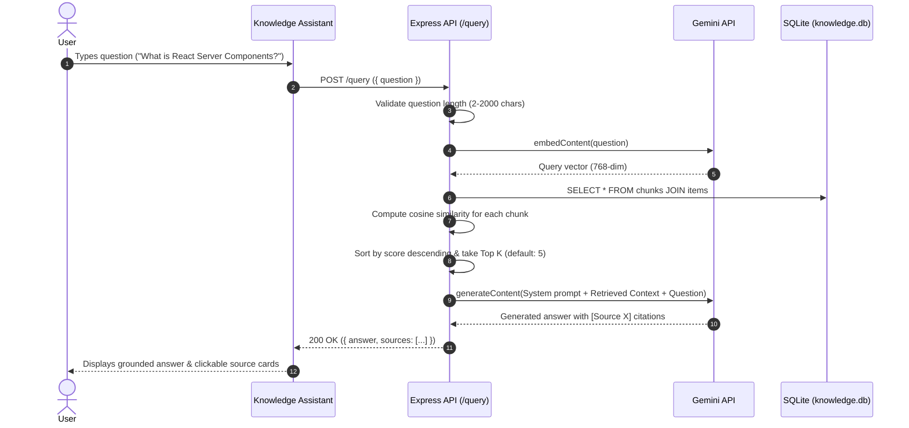

# Turium AI Knowledge Inbox

> A production-style, minimal RAG (Retrieval-Augmented Generation) application that lets users ingest notes and URLs, performs boundary-aware chunking and vector embedding, and answers natural-language questions grounded strictly in saved knowledge with citations.

**https://knowledge-ai-pied.vercel.app/**

---

## Table of Contents
1. [Core Features](#core-features)
2. [High-Level Architecture](#high-level-architecture)
3. [Pipelines & Data Flow](#pipelines--data-flow)
   - [Content Ingestion Pipeline](#1-content-ingestion-pipeline)
   - [Semantic Search & RAG Pipeline](#2-semantic-search--rag-pipeline)
4. [Data Model & Storage](#data-model--storage)
5. [Project Structure](#project-structure)
6. [Tech Stack](#tech-stack)
7. [API Specification](#api-specification)
8. [Configuration & Environment Variables](#configuration--environment-variables)
9. [Getting Started (Step-by-Step)](#getting-started-step-by-step)
10. [Non-Functional Expectations & Tradeoff Awareness](#non-functional-expectations--tradeoff-awareness)
    - [1. Chunking Approach Rationale](#1-chunking-approach-rationale)
    - [2. Vector Store Choice](#2-vector-store-choice)
    - [3. What Breaks at Scale](#3-what-breaks-at-scale)
    - [4. Production Architecture Changes](#4-production-architecture-changes)
11. [Debuggability & Error Handling](#debuggability--error-handling)
12. [Verification & Manual Testing](#verification--manual-testing)

---

## Core Features

- **Multi-Source Ingestion**:
  - **Plain Text Notes**: Save quick notes, meeting minutes, code snippets, or documentation directly.
  - **URL Web Scraping**: Ingest web pages server-side using Cheerio, stripping navigation, footers, scripts, and styles to retain pure readable content.
- **Intentional Chunking**: 900-character segments with 150-character overlap, utilizing backwards boundary lookback (`. `, `\n`, ` `) to avoid severing sentences mid-thought.
- **Local Vector Storage**: Embedded with 768-dimensional vectors stored in SQLite (`better-sqlite3`) with WAL (Write-Ahead Logging) enabled.
- **Context-Grounded RAG**: Cosine-similarity ranked retrieval of Top-$K$ relevant chunks; LLM generates answers restricted strictly to retrieved context with inline citations (`[Source 1]`, `[Source 2]`).
- **Resilient API Layer**: Automatic exponential backoff retry for transient upstream AI capacity surges (503/429), structured JSON request/error logging, and strict Zod validation.
- **Modern Responsive Frontend**: React 19 + Vite 7 styled with Tailwind CSS v4, featuring a slide-out Knowledge Assistant drawer, live item counts, and status indicators.

---

## High-Level Architecture

```
+-----------------------------------------------------------------------------------+
|                                  USER / BROWSER                                   |
|   +--------------------------+                     +--------------------------+   |
|   |   Add Note / URL Panel   |                     |  Knowledge Assistant     |   |
|   +------------+-------------+                     +------------+-------------+   |
+----------------|------------------------------------------------|-----------------+
                 | HTTP POST /ingest                              | HTTP POST /query
                 v                                                v
+-----------------------------------------------------------------------------------+
|                             EXPRESS.JS BACKEND (Node 20+)                         |
|                                                                                   |
|  +--------------------+   +---------------------+   +--------------------------+  |
|  | Request Validation |   | Cheerio Web Scraper |   | In-Memory Cosine Ranker  |  |
|  |    (Zod Schema)    |   | (Boilerplate Strip) |   |  (Top-K Similarity Scan) |  |
|  +---------+----------+   +----------+----------+   +------------+-------------+  |
|            |                         |                           |                |
|            v                         v                           |                |
|  +----------------------------------------------+                |                |
|  |    Boundary-Aware Chunking Engine            |                |                |
|  |    (900 chars / 150 overlap / punctuation)   |                |                |
|  +-----------------------+----------------------+                |                |
|                          |                                       |                |
|                          v                                       v                |
|  +-----------------------------------------------------------------------------+  |
|  |               SQLite Engine (better-sqlite3 / WAL Mode)                     |  |
|  |   - items (id, type, title, source, content, created_at)                    |  |
|  |   - chunks (id, item_id, chunk_index, content, embedding, created_at)       |  |
|  +---------------------------------------+-------------------------------------+  |
+------------------------------------------|----------------------------------------+
                                           |
                    Vector Embeddings &    |    Prompt + Context
                    Generation Requests    |
                                           v
                       +---------------------------------------+
                       |           GOOGLE GEMINI API           |
                       |  - gemini-embedding-001 (768-dim)     |
                       |  - gemini-2.5-flash (Grounded Chat)   |
                       +---------------------------------------+
```

---

## Pipelines & Data Flow

### 1. Content Ingestion Pipeline



### 2. Semantic Search & RAG Pipeline



---

## Data Model & Storage

SQLite is configured via `better-sqlite3` in **WAL (Write-Ahead Logging)** mode.

### Relational Schema

```sql
-- Main items table (stores raw note or scraped web page)
CREATE TABLE IF NOT EXISTS items (
  id INTEGER PRIMARY KEY AUTOINCREMENT,
  type TEXT NOT NULL CHECK(type IN ('note', 'url')),
  title TEXT NOT NULL,
  source TEXT NOT NULL,
  content TEXT NOT NULL,
  created_at TEXT NOT NULL DEFAULT (datetime('now'))
);

-- Semantic chunks table (stores chunk text and vector embedding)
CREATE TABLE IF NOT EXISTS chunks (
  id INTEGER PRIMARY KEY AUTOINCREMENT,
  item_id INTEGER NOT NULL,
  chunk_index INTEGER NOT NULL,
  content TEXT NOT NULL,
  embedding TEXT NOT NULL, -- JSON-stringified 768-dim float array
  created_at TEXT NOT NULL DEFAULT (datetime('now')),
  FOREIGN KEY(item_id) REFERENCES items(id) ON DELETE CASCADE
);

CREATE INDEX IF NOT EXISTS idx_chunks_item_id ON chunks(item_id);
CREATE INDEX IF NOT EXISTS idx_items_created_at ON items(created_at DESC);
```

### SQLite Storage Files
- **`knowledge.db`**: Primary database file holding committed tables and indexes.
- **`knowledge.db-wal`**: Write-Ahead Log storing incoming writes before checkpointing to allow concurrent readers.
- **`knowledge.db-shm`**: Shared memory index coordinating concurrent connections.

---

## Project Structure

```
turium-ai-knowledge-inbox/
│
├── README.md                      # Comprehensive project documentation & architecture guide
│
├── backend/                       # Node.js Express Backend
│   ├── .env                       # Active environment configuration
│   ├── .env.example               # Environment template
│   ├── package.json               # Backend dependencies (express, @google/genai, better-sqlite3, etc.)
│   ├── data/
│   │   └── knowledge.db           # SQLite database file (auto-created)
│   └── src/
│       ├── server.js              # Application entry point, CORS, request logger & route mounting
│       ├── config/
│       │   └── env.js             # Zod-validated environment variables
│       ├── db/
│       │   ├── database.js        # SQLite connection, WAL pragma & DDL schema creation
│       │   └── repository.js      # DB queries (createItem, createChunks, getAllChunks, listItems)
│       ├── middleware/
│       │   └── errorHandler.js    # Centralized error handler, status mapping & structured JSON logging
│       ├── routes/
│       │   ├── ingest.js          # POST /ingest route (Zod schema validation)
│       │   ├── items.js           # GET /items route
│       │   └── query.js           # POST /query route
│       └── services/
│           ├── chunking.js        # Boundary-aware text chunking algorithm
│           ├── gemini.js          # Google Gemini embedding, chat generation & retry backoff
│           ├── ingestion.js       # URL fetcher, Cheerio HTML parser & ingestion coordinator
│           └── rag.js             # Cosine similarity calculation, ranking & RAG prompt builder
│
└── frontend/                      # React 19 + Vite 7 Frontend
    ├── index.html                 # HTML shell with Google Fonts Inter & favicon
    ├── package.json               # Frontend dependencies (react, tailwindcss, @tailwindcss/vite)
    ├── vite.config.js             # Vite configuration with @tailwindcss/vite and react plugins
    └── src/
        ├── main.jsx               # React DOM entry point
        ├── styles.css             # Tailwind CSS v4 entry & custom selection/animation rules
        ├── App.jsx                # Main page shell, sticky topbar, layout & hero section
        ├── components/
        │   ├── AddContent.jsx     # Ingestion card with Note/URL tabbed controls and inputs
        │   ├── ItemsList.jsx      # Scrollable saved library items with chunk counters
        │   └── AskQuestion.jsx    # Slide-out Knowledge Assistant panel with live citations
        ├── hooks/
        │   └── useItems.js        # Custom hook for items polling, loading & refresh state
        └── lib/
            └── api.js             # Type-safe client HTTP fetch wrapper for backend endpoints
```

---

## Tech Stack

| Layer | Technology | Selection Rationale |
| :--- | :--- | :--- |
| **Frontend Framework** | **React 19 + Vite 7** | Fast HMR, lightweight bundle, standard hook-based state management. |
| **Styling** | **Tailwind CSS v4** | Modern utility-first styling with `@tailwindcss/vite`, zero runtime CSS overhead, clean dark theme. |
| **Backend Framework** | **Node.js 20+ & Express** | Lightweight, asynchronous I/O, minimal boilerplate without overengineering. |
| **Database** | **SQLite (`better-sqlite3`)** | Zero external infrastructure, ACID compliance, in-process speed, and WAL mode concurrency. |
| **Embedding Model** | **`gemini-embedding-001`** | High-quality 768-dimensional semantic text vectors. |
| **Chat LLM** | **`gemini-2.5-flash`** | Fast inference, grounded prompt adherence, low latency. |
| **HTML Parser** | **Cheerio** | Robust server-side DOM parsing to cleanly extract article text from URLs. |
| **Validation** | **Zod** | Type-safe runtime schema validation for environment variables and API payloads. |

---

## API Specification

All routes are mounted at both root (e.g. `/ingest`) and with `/api` prefix (e.g. `/api/ingest`).

### 1. Ingest Content: `POST /ingest`

Ingests a plain text note or a web URL.

#### Request Headers
```http
Content-Type: application/json
```

#### Request Body (Note)
```json
{
  "type": "note",
  "title": "Architecture Overview",
  "content": "RAG systems retrieve relevant context from an indexed knowledge store before generating answers."
}
```

#### Request Body (URL)
```json
{
  "type": "url",
  "title": "FastAPI Documentation",
  "url": "https://fastapi.tiangolo.com/"
}
```

#### Success Response (`201 Created`)
```json
{
  "item": {
    "id": 1,
    "type": "note",
    "title": "Architecture Overview",
    "source": "note",
    "content": "RAG systems retrieve relevant context...",
    "created_at": "2026-09-28 05:00:00",
    "chunk_count": 1
  }
}
```

#### Validation Error (`400 Bad Request`)
```json
{
  "error": "Invalid request",
  "details": [
    {
      "code": "invalid_union_discriminator",
      "options": ["note", "url"],
      "path": ["type"],
      "message": "Invalid discriminator value. Expected 'note' | 'url'"
    }
  ]
}
```

---

### 2. List Items: `GET /items`

Retrieves all saved notes and URLs ordered by creation time descending.

#### Success Response (`200 OK`)
```json
{
  "items": [
    {
      "id": 2,
      "type": "url",
      "title": "FastAPI Documentation",
      "source": "https://fastapi.tiangolo.com/",
      "created_at": "2026-09-28 05:05:00",
      "chunk_count": 4
    },
    {
      "id": 1,
      "type": "note",
      "title": "Architecture Overview",
      "source": "note",
      "created_at": "2026-09-28 05:00:00",
      "chunk_count": 1
    }
  ]
}
```

---

### 3. Delete Item: `DELETE /items/:id`

Deletes a saved note or URL item and cascades deletion to all its vector chunks.

#### Success Response (`200 OK`)
```json
{
  "success": true,
  "message": "Item deleted successfully"
}
```

#### Error Response (`404 Not Found`)
```json
{
  "error": "Item not found"
}
```

---

### 4. Ask Question: `POST /query`

Executes the RAG pipeline: embeds query, finds Top-$K$ chunks, generates answer with citations.

#### Request Body
```json
{
  "question": "What is the purpose of a RAG system?"
}
```

#### Success Response (`200 OK`)
```json
{
  "answer": "According to [Source 1], a RAG system retrieves relevant context from an indexed knowledge store before generating answers, ensuring factual accuracy.",
  "sources": [
    {
      "id": 1,
      "itemId": 1,
      "title": "Architecture Overview",
      "source": "note",
      "type": "note",
      "content": "RAG systems retrieve relevant context from an indexed knowledge store before generating answers.",
      "score": 0.8842
    }
  ]
}
```

---

### 5. Health Check: `GET /health`

Checks server liveness.

#### Success Response (`200 OK`)
```json
{
  "status": "ok"
}
```

---

## Configuration & Environment Variables

Configure backend environment variables in [backend/.env](file:///c:/Users/rdani/Downloads/turium-ai-knowledge-inbox/turium-ai-knowledge-inbox/backend/.env):

| Variable | Type | Default | Description |
| :--- | :--- | :--- | :--- |
| `PORT` | `number` | `4000` | HTTP port on which the Express server listens. |
| `FRONTEND_URL` | `string` | `http://localhost:5173` | Allowed origin for CORS headers. |
| `GEMINI_API_KEY` | `string` | *(Required)* | Google Gemini API key for embeddings and generation. |
| `GEMINI_CHAT_MODEL` | `string` | `gemini-2.5-flash` | Gemini model name used for question answering. |
| `GEMINI_EMBEDDING_MODEL`| `string` | `gemini-embedding-001` | Gemini model name used for vector embeddings. |
| `TOP_K` | `number` | `5` | Maximum number of top chunks passed as context to the LLM. |
| `MAX_CONTENT_CHARS` | `number` | `50000` | Safety truncation limit for incoming notes or scraped web content. |

---

## Getting Started (Step-by-Step)

### Prerequisites
- **Node.js**: `v20.0.0` or higher
- **npm**: `v9.0.0` or higher
- **Google Gemini API Key**: [Get an API Key here](https://aistudio.google.com/)

### 1. Backend Setup

```bash
# Navigate to backend directory
cd backend

# Install dependencies
npm install

# Create environment file from template
cp .env.example .env

# Open .env and insert your GEMINI_API_KEY
# GEMINI_API_KEY="your-actual-api-key"

# Run development server
npm run dev
```
Backend will start on: `http://localhost:4000`

### 2. Frontend Setup

In a new terminal:
```bash
# Navigate to frontend directory
cd frontend

# Install dependencies
npm install

# Run Vite development server
npm run dev
```
Frontend will be available at: `http://localhost:5173`

---

## Non-Functional Expectations & Tradeoff Awareness

This section directly addresses the key evaluation criteria outlined in the Turium interview specification:

### 1. Chunking Approach Rationale
- **Strategy**: 900-character maximum window with a 150-character overlap, augmented with backward boundary scanning.
- **Why**:
  - Arbitrary character slicing splits sentences or words in half (e.g. cutting `"not acceptable"` into `"not"` and `"acceptable"`), which ruins the embedding model's ability to capture semantic intent.
  - Our algorithm scans backwards from the 900-char mark for natural punctuation (`. `), line breaks (`\n`), or whitespace (` `) within the last 35% of the window.
  - The 150-character overlap ensures that relational context connecting consecutive ideas is preserved across both chunk vectors.

### 2. Vector Store Choice
- **Strategy**: SQLite (`better-sqlite3`) storing vector arrays serialized as JSON, with similarity computed in-process via cosine similarity.
- **Why**:
  - **Zero External Infrastructure**: Runs without external Docker containers, Kubernetes pods, or managed cloud vector databases (Pinecone/Milvus), keeping the codebase fully portable and single-command runnable.
  - **Relational Integrity**: Articles and chunk vectors exist inside a single relational database with foreign keys, cascade deletions, and index lookups.
  - **WAL Mode**: SQLite's Write-Ahead Logging allows concurrent readers and writers without database locking bottlenecks.

### 3. What Breaks at Scale
1. **$O(N)$ Similarity Search**: Brute-force linear scan across all chunks becomes a bottleneck as the corpus scales beyond 50,000 chunks, increasing CPU time and query latency.
2. **Synchronous Ingestion Latency**: Scraping complex URLs, downloading HTML, and requesting batch embeddings happens in the request-response thread. Slow or hanging third-party websites can tie up Express event loop resources.
3. **Memory Pressure**: Loading all chunk embeddings into Node.js memory for cosine comparison does not scale to millions of high-dimensional vectors.
4. **SQLite Single-Writer Lock**: While WAL mode allows multiple concurrent readers, SQLite serializes all write transactions. High-concurrency write workloads will encounter lock contention.

### 4. Production Architecture Changes
1. **Dedicated Vector Indexing**:
   - Migrate chunk vectors to `pgvector` (PostgreSQL) or Qdrant/Milvus utilizing **HNSW (Hierarchical Navigable Small World)** indexing for sub-millisecond approximate nearest neighbor (ANN) retrieval.
2. **Asynchronous Background Ingestion Queue**:
   - Decouple ingestion using **BullMQ + Redis** or AWS SQS. The API returns `202 Accepted` with a `job_id`, worker processes fetch and embed asynchronously, and the client receives updates via WebSockets or Server-Sent Events (SSE).
3. **Resilience & Rate Limiting**:
   - The current implementation includes exponential backoff retry for transient 503/429 spikes. In production, add circuit breakers, queue backpressure, and local fallback embedding models (e.g. ONNX runtime).
4. **Hybrid Search & Re-ranking**:
   - Combine dense vector embeddings with BM25 full-text keyword search and pass candidate chunks through a cross-encoder re-ranker (e.g., Cohere Re-rank) to optimize precision.
5. **Multi-Tenancy & Authorization**:
   - Introduce tenant IDs and row-level security (RLS) to isolate user libraries in multi-tenant enterprise environments.

---

## Debuggability & Error Handling

### Structured Request & Error Logging
All incoming requests and errors are emitted as structured JSON objects for easy ingestion into log aggregators (Datadog, CloudWatch, Grafana Loki):

```json
{"level":"info","method":"POST","path":"/query","status":200,"durationMs":482}
```

```json
{"level":"error","status":503,"message":"AI model is temporarily experiencing high demand. Please retry in a few moments.","stack":"..."}
```

### Sensible HTTP Status Codes
- `200 OK`: Successful retrieval or query response.
- `201 Created`: Content successfully ingested and indexed.
- `400 Bad Request`: Input validation failed (Zod error details provided).
- `404 Not Found`: Unknown route.
- `503 Service Unavailable`: Upstream AI model temporarily unavailable (with automatic retry).
- `500 Internal Server Error`: Unhandled server exception.

---

## Verification & Manual Testing

### Testing Ingest via `curl`

```bash
# Ingest a text note
curl -X POST http://localhost:4000/ingest \
  -H "Content-Type: application/json" \
  -d '{"type":"note","title":"TypeScript Tips","content":"TypeScript provides static type definitions to catch errors early during development."}'

# Ingest a URL
curl -X POST http://localhost:4000/ingest \
  -H "Content-Type: application/json" \
  -d '{"type":"url","url":"https://en.wikipedia.org/wiki/Retrieval-augmented_generation"}'
```

### Testing Query via `curl`

```bash
curl -X POST http://localhost:4000/query \
  -H "Content-Type: application/json" \
  -d '{"question":"What does TypeScript provide?"}'
```

### Checking Saved Items

```bash
curl http://localhost:4000/items
```

---

## Summary of Completed Requirements

- [x] Content Ingestion (plain text notes + server-side URL scraping with Cheerio)
- [x] Intentional boundary-aware chunking strategy (900 chars, 150 overlap)
- [x] Vector embeddings generation & storage in SQLite (WAL mode)
- [x] Semantic cosine similarity search & Top-$K$ retrieval
- [x] Grounded generation with inline source citations (`[Source X]`)
- [x] Responsive frontend with React 19, hooks, and Tailwind CSS v4
- [x] Slide-out Knowledge Assistant interface
- [x] Structured JSON logging & sensible HTTP status codes
- [x] Documented architectural tradeoffs & scale breakdown analysis
